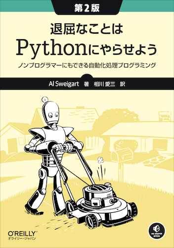

# 退屈なことはPythonにやらせよう 第2版

---

---

本リポジトリはオライリー・ジャパン発行書籍『[退屈なことはPythonにやらせよう 第2版](https://www.amazon.co.jp/dp/4873119278/)』（原書名『[Automate the Boring Stuff with Python, 2nd Edition](https://nostarch.com/automatestuff2)』） のサポートサイトです。

## サンプルコード

サンプルコードの解説は本書籍をご覧ください。

## 正誤表

本書の正誤情報は以下のページで公開しています。

https://github.com/oreilly-japan/automatestuff2-ja/wiki/errata

本ページに掲載されていない誤植など間違いを見つけた方は、[japan＠oreilly.co.jp](<mailto:japan＠oreilly.co.jp>)までお知らせください。
